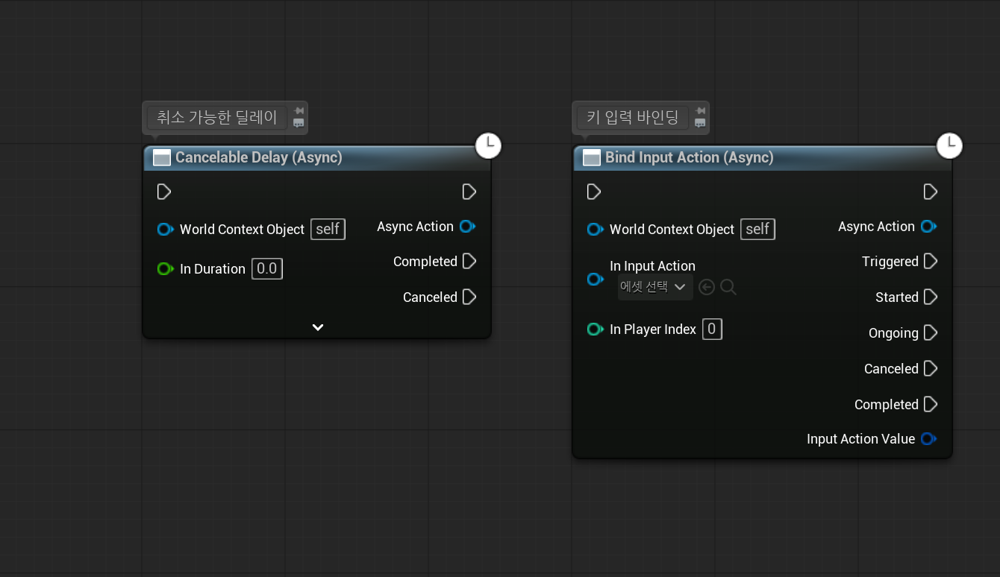
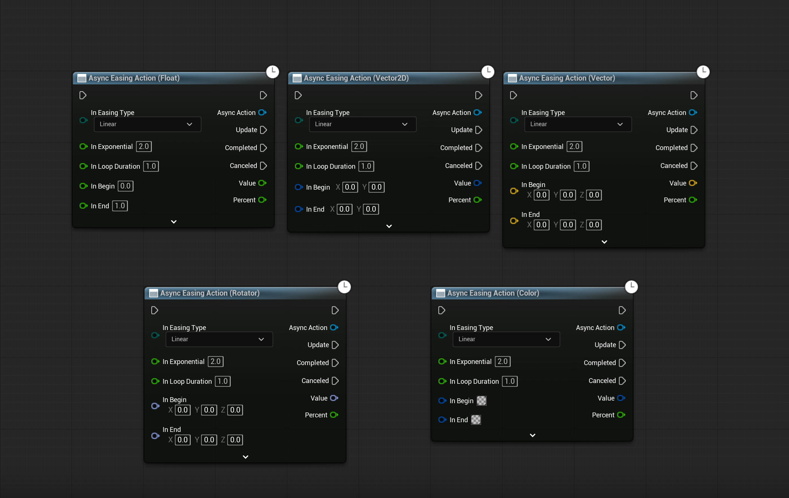
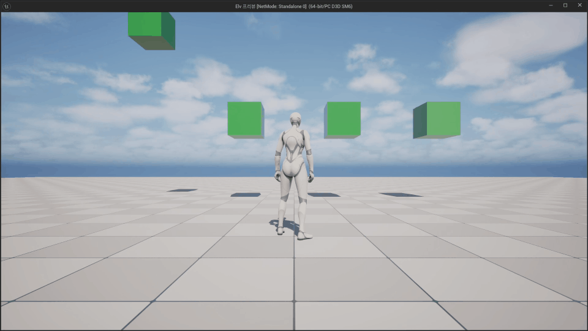

# EggAsync

EggAsync는 언리얼 엔진 5.8용 블루프린트 비동기 액션 플러그인입니다.

취소 가능한 딜레이, Enhanced Input 이벤트 바인딩, 다양한 값 형식의 Easing 액션을 제공합니다.

[UE5 Simple Easing Function](https://github.com/Youllee/UE5_Simple_Easing_Function)의 기능이 이 플러그인에 통합되었습니다.

## 기능

### 취소 가능한 딜레이

- `Cancelable Delay (Async)`는 지정한 시간이 지나면 `Completed` 이벤트를 호출합니다.
- 반환된 `Async Action`에서 `Cancel`을 호출하면 대기를 끝내고 `Canceled` 이벤트를 호출합니다.
- 대기 시간이 0 이하이면 다음 틱에 완료됩니다. 게임이 일시 정지된 동안에도 시간을 진행하는 옵션이 있습니다.

### 입력 액션 바인딩

- `Bind Input Action (Async)`는 Enhanced Input 이벤트와 입력 값을 전달합니다.
- 지원하는 이벤트는 `Triggered`, `Started`, `Ongoing`, `Canceled`, `Completed`입니다.
- 반환된 액션을 취소하면 입력 바인딩이 해제됩니다.
- `SetPause`는 입력 바인딩을 유지하면서 이벤트 전달만 일시 중지합니다.
- 플레이어의 입력 컴포넌트가 교체되면 새 컴포넌트에 다시 바인딩해야 합니다.

### Easing 액션

- `Async Easing Action`은 `Float`, `Vector2D`, `Vector`, `Color`, `Rotator` 값을 보간합니다.
- 다양한 Easing 곡선과 반복·왕복 실행을 지원하며, 초당 업데이트 횟수도 제한할 수 있습니다.
- 액션을 직접 완료하거나 취소할 수 있고, 게임이 일시 정지된 동안에도 틱을 실행할 수 있습니다.

Easing 액션의 동작 예시는 다음과 같습니다.

## 설치

1. 원하는 릴리즈 버전의 플러그인을 내려받습니다.
2. ZIP을 `<프로젝트>/Plugins/EggAsync/`에 풀거나 저장소 파일을 같은 경로에 복사합니다. `EggAsync.uplugin`이 이 폴더 바로 아래에 있어야 합니다.
3. 프로젝트를 빌드한 뒤 에디터를 실행합니다. 릴리즈 ZIP에는 소스가 포함되어 있으며 미리 빌드된 바이너리는 없습니다.
4. 에디터의 **플러그인 > ProjectEgg**에서 **Egg Async**를 활성화합니다.

## 요구 사항

- 언리얼 엔진 5.8
- Enhanced Input 플러그인

## 라이선스

MIT 라이선스를 따릅니다. 자세한 내용은 [LICENSE](LICENSE)를 참고하세요.
